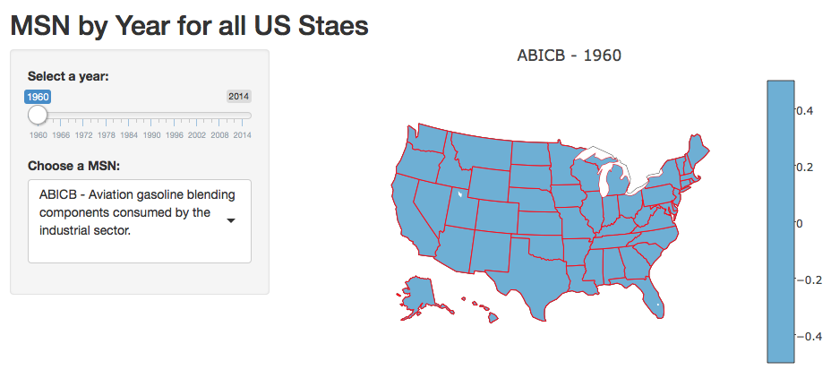

## What is SEDS Data?

The State Energy Data Systems data is explained at https://www.eia.gov/state/seds/

 - Source of the U.S. Energy Information Administration's (EIA) comprehensive state energy statistics
 - Historical time series of energy production, consumption, prices, and expenditures by state 
 - Defined as consistently as possible over time and across sectors for analysis and forecasting purposes

## The Interactive Map

The Shiny app shows a map, created with Plotly, and controls that allow you to select a year and a MSN. It looks like this:



The app is at: https://nathan-to.shinyapps.io/shiny_seds/

The code is available at: https://github.com/Data-Science-Projects/plotly_examples/tree/master/shiny_seds

## The Data

The data used is based on the SEDS data, in a tidied form available in Kaggle here:

https://www.kaggle.com/nathanto/seds-1960-2014F

The R code for downloading and tidying the data is also shown at the link above

## An Example - MSN "DKEIP", Year 2000:

```{r, echo = FALSE, warning = FALSE, message = FALSE}    
library(plotly)
all_states_long_df <- read.csv("seds_all_states_long.csv", check.names = FALSE)
borders <- list(color = toRGB("red"))
#Set up some mapping options
map_options <- list(
  scope = 'usa',
  projection = list(type = 'albers usa'),
  showlakes = TRUE,
  lakecolor = toRGB('white')
)

msn <- "DKEIP"
year <- "2000"
plot_df <- subset(all_states_long_df, (MSN == msn & Year == year))
map <- plot_ly(z = ~plot_df$value, locations = ~plot_df$State, type = 'choropleth', locationmode = 'USA-states', color = plot_df$value, colors = 'Blues', marker = list(line = borders)) %>%
         layout(title = paste(substr(msn, 1, 5), "-", year), geo = map_options)
map
```

